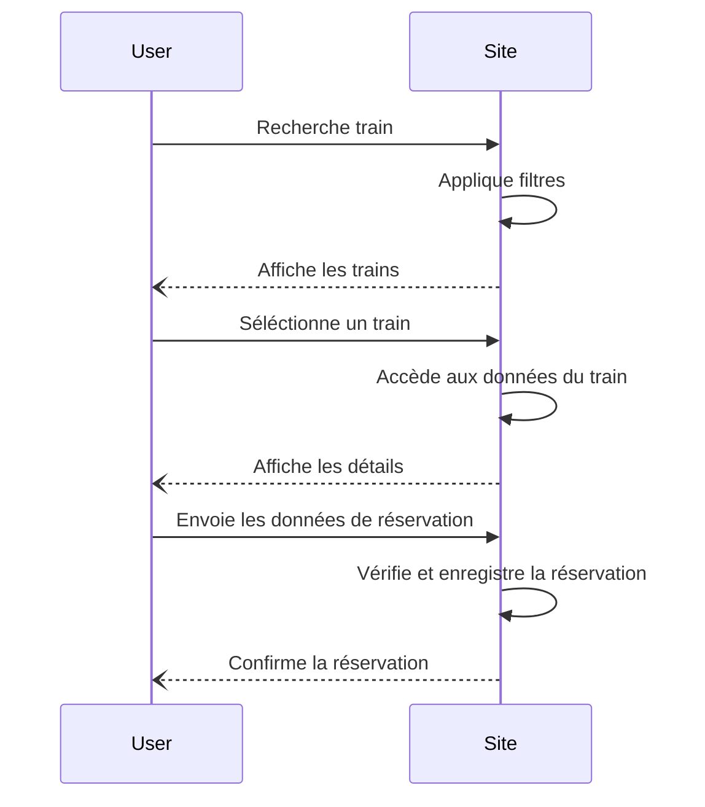
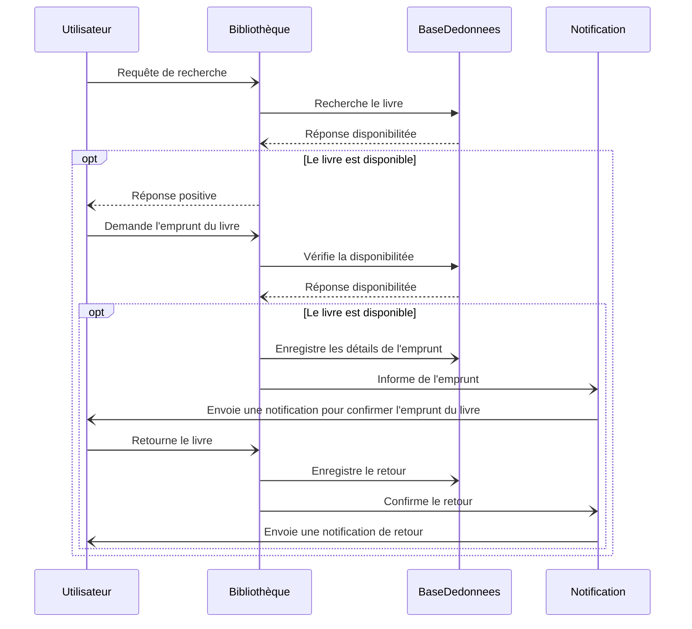
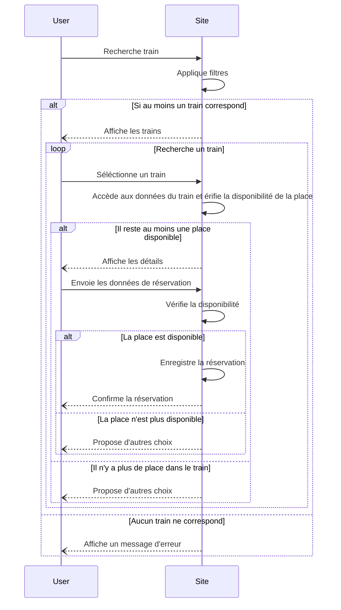

---
created:
  - "2025-09-25 16:53"
---
>[!info] Contact 
Nom Prénom : Monnier Matthieu
Email : matthieumm444444@gmail.com
Email Scolaire : matthieu.monnier@ecoles-epsi.net

---
- 2025-09-25 16:53 - Création initiale
---

> [!info] Sommaire
> ```table-of-contents
> ```

---
# TP1


# TP2

# TP3

